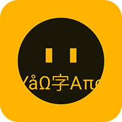

# Word Deposit App 2.0 (iOS)

My name is Max Kalik and I got an experience living in a new country with a new language. I had a lot of trouble learning new languages especially if this language not so popular in the world. I was learning a language which’s native speakers are less than 1.1 million in the world and I could not find any app which would help me to learn the language and allow me to memorize new words.

This led me to an idea to develop the app which allows creating your own vocabulary using your native or language you know very well and the one you are learning. I was inspired by [Lingualeo](https://github.com/LinguaLeo). But I need to have universal model where I can use an application with any laguages.

Word Deposit App might be useful if you have decided to learn a new language. If you do not want to use some specific app and learn how to use it, then Word Deposit is definitely for you who want to make things easy. It will allow you to create your own vocabulary by adding new words in any language you want. This app is especially great if you are learning some language that is less spoken.

## How does it work?

Add to vocabulary at least 10 words with translation.  After that, you can start your training to find out how well you remember new words. You will find in the navigation tab "Trainers" which will help you memorize the new words. There are a couple of trainers now. One will request you to choose the right meaning for the word from your language to the one you are learning, the other trainer - the other way around. The trainer will show the word and you will have to choose the right meaning from the list of five possible translations. If you chose the right meaning of the word, it will be marked green. If you made a mistake and chose the wrong answer, it will color your choice in red and highlight which is the right answer. Repeating and using trainers constantly will help you to learn faster and easier new words and repeat the ones you know well.

You can add to your vocabulary as many words as you wish, also delete them, and correct spelling mistakes at any time. If you will try to add the word which already is added, the app will inform you to avoid making duplicates.

Add to vocabulary as many words as you wish and memories them using the Trainers just for a few minutes a day.  The app has also a dark mode that you will like.

I will be very thankful for your feedback and suggestions to improve the app and make it more attractive.

## Current version 1.0 (React Native)

<table style="border-collapse: collapse; border: none;">
  <tbody>
    <tr>
      <td style="border: none;">
        
      </td>
      <td style="border: none;">
        
      </td>
    </tr>
  </tbody>
</table>
